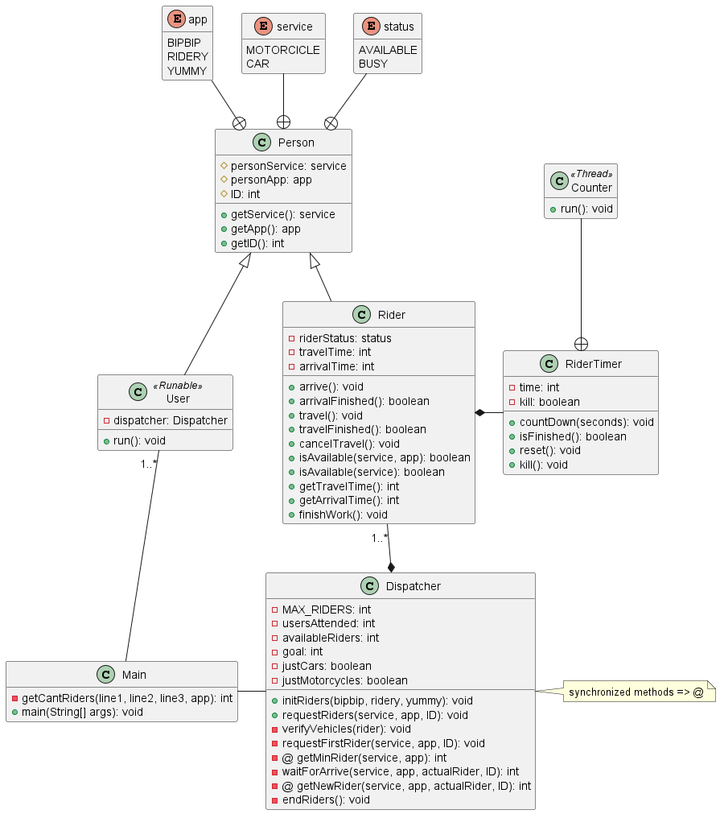

# Riders Attack

## Integrantes
- Miguel Ciavato C.I. 30.541.929
- Sofia Marcano C.I. 29.765.263

## Consideraciones

Debido a que las preferencias de los usuarios y los vehículos de los conductores son asignados de manera aleatoria, debemos considerar el improbable caso en el que un usuario solicite un viaje con un vehículo para el cual no existe un conductor, ya sea disponible u ocupado.
Este caso se manejará permitiendo que los usuarios cambien el vehículo del viaje que han solicitado para permitirles llegar a su destino de todas formas.

## Clases implementadas

### Main
Ésta es la clase principal del programa y contiene unicamente el método main.
Se recibe el nombre del archivo de entrada como argumento y se abre dicho archivo. Luego se procede a leer el archivo para obtener en número de usuarios y el número de conductores de cada aplicación. Estos datos son usados para crear e inicializar el despachador de viajes o Dispatcher y los usuarios.
Por último, este método se encarga de arrancar los hilos de usuarios. 

### Dispatcher
Es la clase monitor, encargada de la sincronización.
#### Constructor
Se inicializan la cantidad de usuarios que los conductores deben llevar, y se inicializan dichos conductores.
#### initRiders
Inicializa el arreglo de conductores, este arreglose divide en tres secciones, cada una correspodiente a cada aplicación,
#### requestRider
#### requestFirstRider
#### getMinRider
#### waitForArrive
#### getNewRider
#### endRiders
